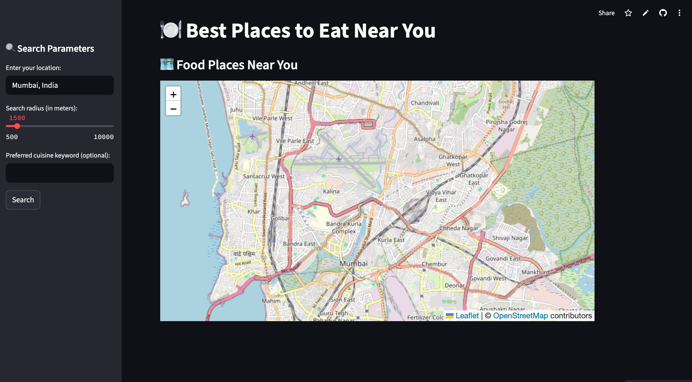

# 🍽️ Best Places to Eat Near You

A real-time restaurant locator web app built using **Streamlit**, **Folium**, and the **Geoapify Places API**. Simply enter your location or let the app detect it automatically, choose a search radius, filter by preferred cuisine, and explore top nearby restaurants on an interactive map.

---

## 📸 Preview

 <!-- Update path if needed -->

---

## 🚀 Features

* 🔍 **Live location detection** on app startup (IP-based fallback)
* 🗺️ **Interactive map** powered by Leaflet via Folium
* 🍜 **Cuisine-based filtering** (e.g., "Chinese", "Pizza", "North Indian")
* 🎯 Adjustable **search radius** (500m to 10km)
* 🎨 **Dark/Light theme toggle**
* 📋 Clean and scrollable **restaurant list view**

---

## 🛠️ Tech Stack

* **Frontend**: [Streamlit](https://streamlit.io/)
* **Mapping**: [Folium](https://python-visualization.github.io/folium/)
* **Geocoding**: [Geopy](https://geopy.readthedocs.io/)
* **Places API**: [Geoapify](https://www.geoapify.com/)
* **Styling**: Custom CSS, Google Fonts

---

## 🧪 Setup Instructions

### 1. Clone the repo

```bash
git clone https://github.com/yourusername/food-finder-app.git
cd food-finder-app
```

### 2. Install dependencies

```bash
pip install -r requirements.txt
```

### 3. Add your API key

Create a `.streamlit/secrets.toml` file and add your **Geoapify API key**:

```toml
GEOAPIFY_API_KEY = "your_actual_api_key_here"
```

You can get one for free from [Geoapify](https://www.geoapify.com/get-started/).

### 4. Run the app

```bash
streamlit run main.py
```

---

## ✅ To-Do / Enhancements

* Add user ratings and reviews (if supported by API)
* Bookmark or save favorite places
* Integration with Google Maps or Zomato for richer data
* Mobile-responsive tweaks

---

## 📄 License

This project is licensed under the MIT License. See [LICENSE](LICENSE) for details.

---

## 👨‍💻 Author

Built with ❤️ by Aadvik Mishra

